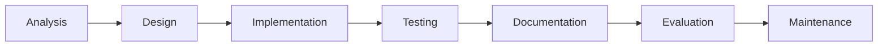

# mulfok's Higher Computing Ultimate Revision Guide

**Contents:**
```toc
 style: number
```

> # wait(“!”);
> If you are viewing this from the original `.md` filetype, it is highly recommended that you use [Obsidian](https://obsidian.md/) to read this! It supports the Mermaid engine used to display the diagrams in this document!

___
### Software Design Development
#### Development Methodologies
##### Types of Development Methodologies
During an exam, you must be able to describe/compare two types of development methodologies: ==Iterative (Waterfall), and Agile== methodologies.

_Iterative:_
- Follows a set of specific steps in order
- Allows for iteration; __to repeat or revisit tasks in light of new information so that changes or improvements can be made.__

_Agile:_
- Allows developers to create software in the way most suited to their circumstances
- Relies on string leadership, good communication, teamwork, etc.

##### Iterative Methodologies
The iterative method follows a set of steps in order - but also allows for iteration.
Most commonly referred to, the **waterfall model** is the most used iterative methodology.



So what is *iteration?* Essentially, if a development team chooses to use an *iterative methodology*, they will repeat stages like design, implementation, and testing regularly. If a development team feels that they have done poorly on a step, they are free to go back a couple stages and *reiterate* later.


Iteration can take place **between stages, and within stages.**

### Computer Systems

### Database Design Development
#### Requirements
##### End User Requirements
End user requirements clearly state the **tasks that users wish to perform.**

In the example of a doctor’s surgery, developers could ask that each _user group_ lists the tasks that they wish to be able to complete. In this example, three different end user groups exist — reception staff, medical staff, and portering staff.

Reception staff report that they must be able to:
- Enrol patients
- Search for basic patient data
- Output appointment letters
- Output a summary of patient details.

Medical staff report that they must be able to:
- Add medical notes
- Generate onward referrals
- Access confidential medical records
- Output prescriptions

Portering staff report that they must be able to:
- Know patient whereabouts
- Know the level of patient mobility (_independently mobile or mobile with assistance_)
- Know if need assistance with communication (_e.g. interpreter_)
- Access where patients appointments are (_e.g. x-ray, physiotherapy_)

##### Functional Requirements
Functional requirements should relate to the **tasks that the database system will perform,** usually in the form of searching and sorting (queries).

Functional requirements may also provide detail around the data that must be held in the database.

In the example of a doctor’s surgery, the functional requirements could include the following:
- A basic patient data table
- A medical records table

**Basic patient data table**
This table should include fields for:
-   patient ID
-   first name
-   surname
-   patient ID
-   first name
-   surname
-   date of birth
-   address
-   contact number
-   whether assistance needed with communication
-   next appointment time
-   next appointment date
-   next appointment location
-   patient whereabouts

The basic patient data table should be linked to a medical records table.

**Medical records table**
The medical records table should include the following:
-   Patient ID
-   Medical record ID
-   Diagnosed illness
-   Medication
-   Patient mobility
-   Blood type

**Simple and complex queries** should exist to allow for searching and sorting on all tables.

**Sorts** should be generated to quickly sort data in all tables.

**Forms** will need to exist to allow all user groups to add or amend records.

Let’s have a look at a past-paper to understand better how to answer these kinds of questions.


#### Entity Relationship Diagrams
An entity relationship diagram shows the relationship between entities.

ERDs include:
- The name of each entity
- The name of each relationship
- The cardinality between entities
- If required, the attributes linked to each entity

![[03 School/03.01 Ultimate Revision Guides/03.01.00 Media/e625a9b55e2ecd8adcb574839ce24ef2]]

*Above is an example of an Entity Relationship Diagram*

In these examples the words _'is used on'_ appear on the line that shows the relationship between the entities. This statement describes the relationship that exists between the entities.

In this case it can be read as 'one surface is used on many sports areas'. It is necessary to include relationship descriptions like this when creating an ERD.

#### Entity Occurrence Diagrams

A **specific example** of an entity is called an **instance** or **entity occurrence.**

An **entity occurrence diagram** shows the relationships between **occurrences of a particular entity.**

In an entity occurrence diagram:
- Each entity is shown as a **tall oval**
- Inside each oval, an occurrence of an entity is shown by a **dot and a description** of the occurrence

Examples of entity occurrence diagrams are shown below.

##### Example 01: One-To-One Relationship
The following table and diagram show the headteachers that manage particular schools.

| School | Headteacher  |
| ------ | ------------ |
| GW11   | Mr Kane      |
| GW17   | Miss Brown   |
| GW24   | Mrs Copeland | 

![[03 School/03.01 Ultimate Revision Guides/03.01.00 Media/bc2b747a82464404a45ac35b2d318238]]

For this entity occurrence diagram:
- Each headteacher manages one, and only one school
- Each school also has one and only one headteacher

This shows that there is a _one-to-one_ relationship between these entities.

##### Example 02: One-To-Many Relationship
The following table and diagram show which teachers are employed at which schools:

| School | Teacher     |
| ------ | ----------- |
| GW24   | Miss Lowe   |
| GW11   | Ms Umar     | 
| GW11   | Mr Connelly |
| GW24   | Mrs Stevens |
| GW17   | Mrs Kyle    |
| GW11   | Ms Laing    |
| GW24   | Mr McGarvey |

For this entity occurrence diagram:
- Each school has multiple teachers employed
- Each teacher only works at one school

![[03 School/03.01 Ultimate Revision Guides/03.01.00 Media/499473a5eeb1b18a5518d6364a631241]]

This shows that there is a _one-to-many_ relationship.

##### Example 03: Many-To-Many Relationship
The following table and diagram show which pupils study which subjects:

| Pupils | Subject |
| --- | --- |
| Ross | Computing |
| Jameel | Mathematics |
| Jena | Physics |
| Ross | Mathematics |
| Alara | Physics |
| Declan | Physics |
| Declan | Computing |
| Alara | Mathematics |

![[03 School/03.01 Ultimate Revision Guides/03.01.00 Media/7a50e703946ded3e587a7a613992d52c]]

In this entity occurrence diagram:
- Each pupil can study multiply subjects
- Each subject can have multiple pupils studying it

This shows that these entities share a _many-to-many_ relationship.

#### SQL
##### Types of Keys
###### Primary

###### Foreign

###### Surrogate
When an entity (table) does not have a naturally occurring primary key it is possible to create a new field that will serve as the primary key.

###### Composite
A **composite key** is a specific type of **primary key** which uses the **contents of two or more fields from a table** to create a unique value.

Consider the number of times certain footballers scored a goal during a tournament.

| Team | Squad Number | Goals |
| --- | --- | --- |
| Aberdeen | 9 | 4 |
| Hearts | 8 | 3 |
| Celtics | 8 | 5 |
| Queen of the South | 11 | 6 |
| Aberdeen | 8 | 5 |

In the above example a single field would not create a set of unique values, eg there are two Aberdeen players, and there are three players with the squad number 8.

However, if you combined the **Team** and **Squad Number** fields, a primary key is created, allowing each player to be uniquely identified. This is an example of a composite key.

###### Compound
A **compound key** is similar to a composite key in that **two or more fields are needed to create a unique value.** However, a compound key is created when two or more **primary keys from different tables** are present as foreign keys within an entity.

Compound keys are always made up of two or more primary keys from other tables. In their own tables, both of these keys uniquely identify data but in the table using the compound key they are both needed to uniquely identify data.

For example, a database about school may already contain, a student table with student number as the primary key. There may be a second table for each course with a primary key called course number.

Class registers could be held in a table called enrolment, with the unique identifier for enrolment in a class being the combination of the student id and the course id.

##### SELECT...FROM
The SELECT statement is used to select data from a database. It is used in conjunction with the FROM statement to choose which table to pull data from.

A simple statement looks like this:
```SQL
SELECT *
FROM Lorem
```
This statement selects all fields from the table _'Lorem'_.
Let's see how an actual query would work.

```SQL
SELECT *
FROM Pupil
```

This query would output:

| PupilID | First Name | Surname | Class | Merit Points |
| ------- | ---------- | ------- | ----- | ------------ |
| 0001    | Zainab     | Singh   | 1G1   | 74           |
| 0002    | David      | Boland  | 1I2   | 12           |
| 0003    | Amy        | Jones   | 1M1   | 55           |
| ...     | ...        | ...     | ...   | ...          |

You can also specify field names to display only those.

```SQL
SELECT PupilID, Surname
FROM Pupil
```

| PupilID | Surname |
| ------- | ------- |
| 0001    | Singh   |
| 0002    | Boland  |
| 0003    | Jones   |
| ...     | ...     | 

##### WHERE
When using SELECT and FROM, you can use the WHERE clause to return records that meet a certain condition.

```SQL
SELECT PupilID, Surname, Class
FROM Pupil
WHERE Class = '1T1';
```

This would return:

| PupilID | Surname     | Class |
| ------- | ----------- | ----- |
| 0001    | Singh       | 1T1   |
| 0004    | McNamee     | 1T1   |
| 0007    | McNamee     | 1T1   |
| 0008    | Matazinadze | 1T1   |

Here, the WHERE clause has been used to only return records where the value for the field 'Class' is '1T1'.

##### AND, OR, >, < and = Operators
You can use the AND, OR, >, <, and = operators, with a WHERE clause. This will refine a search.

These operators are all similar if not just like the operators you'll see in [Software Design and Development](<#software design development>).

###### AND
Using AND allows the database developer to specify more than one condition that a search has to meet. For example:

```SQL
SELECT PupilID, Forename, Surname, Class
FROM Pupil
WHERE Class = '1T1' AND Surname = `McNamee`
```

This would return:

| PupilID | Forename | Surname | Class |
| ------- | -------- | ------- | ----- |
| 0004    | James    | McNamee | 1T1   |
| 0007    | Amy      | McNamee | 1T1   | 

###### OR
Using OR allows the database developer to specify another condition that can be met if one isn't. For example:

```SQL
SELECT PupilID, Forename, Merit_Points
FROM Pupil
WHERE Forename = 'Amy' OR Merit_Points > 60
```

This would return:

| PupilID | Forename | Merit Points |
| ------- | -------- | ------------ |
| 0001    | Zainab   | 74           |
| 0003    | Amy      | 55           |
| 0004    | James    | 88           |
| 0007    | Amy      | 63           |
| 0009    | Beatrice | 77           |
| 0010    | Thomas   | 91           | 

Even though one of the 'Amy's has less than 60 merit points, the record is still returned as the forename matches the first condition.

######  Operators
`>, < and =` are all operators.

| <         | >            | =      |
| --------- | ------------ | ------ |
| Less than | Greater than | Equals |

In the OR statement example, `>` was used to return all the results greater than a particular value. `< and =` can be used in the same way.

##### ORDER BY
ORDER BY is a keyword that can be used to _sort the results you get in a certain order._

There are two arguments that you can use.

| ASC             | DESC             |
| --------------- | ---------------- |
| Ascending Order | Descending Order |                |                  |

For examples:

```SQL
SELECT Forename, Surname, Class
FROM Pupil
ORDER BY Surname ASC
```

This would return:

| Forename | Surname   | Class |
| -------- | --------- | ----- |
| David    | Boland    | 1I2   |
| Antonia  | Gallagher | 1M2   |
| Thomas   | Glacney   | 1M1   |
| Amy      | Jones     | 1M1   |
| ...      | ...       | ...   | 

By default - if no argument is used - then all the records will be sorted in ascending order. But it's still good practise to add the ASC argument. If you want it in descending order, you would use DESC instead.

```SQL
SELECT Forename, Surname, Class
FROM Pupil
ORDER BY Surname DESC
```

This would now return:

| Forename | Surname  | Class |
| -------- | -------- | ----- |
| Zainab   | Singh    | 1T1   |
| Beatrice | Panner   | 1T2   |
| Pawel    | McTavish | 1I1   |
| James    | McNamee  | 1T1   |
| ...      | ...      | ...   | 

###### Sorting Multiple Columns
It is possible to sort by more than one column.

The sorts are written in order of operation, so in the example below, the records would first be sorted by `Class`, and then further sorted by `Merit Points`.

```SQL
SELECT Forename, Class, Merit_Points
FROM Pupil
ORDER BY Class DESC, Merit_Points ASC
```

The records where both sorts are applied are highlighted.

| First Name  | Class   | Merit Points |
| ----------- | ------- | ------------ |
| Amy         | 1T2     | 55           |
| ==Davie==   | ==1T1== | ==12==       |
| ==Antonia== | ==1T1== | ==21==       |
| ==Amy==     | ==1T1== | ==63==       |
| ==James==   | ==1T1== | ==88==       |
| Beatrice    | 1M2     | 77           |
| ...         | ...     | ...          | 

The class column is first fully sorted in _descending order_, and then within each class group, the merit points are sorted in _ascending order_.

##### GROUP BY
GROUP BY is a keyword that groups sets of records by a given criteria. It groups any data that is identical in a field,

The criteria can change based on what field we want to GROUP BY.

In the example below, the query groups pupils by class, and in ascending order.

```SQL
SELECT pupilID, firstname, surname, class, pastoralCareTeacher, meritPoints
FROM Pupil
GROUP BY class
ORDER BY class ASC
```

```ad-warning
Whenever a single query has both GROUP BY and ORDER BY clauses, the GROUP BY **must precede** the ORDER BY. You'll get an error if you don't.

e.g.
~~~SQL
SELECT *
FROM lorem
ORDER BY ipsum ASC
GROUP BY ipsum 
~~~

Would return an error.

~~~SQL
SELECT *
FROM lorem
GROUP BY ipsum
ORDER BY ipsum ASC
~~~

This would work as intended.

```

The table would output:

| PupilID | First Name | Surname   | Class   | Pastoral Care Teacher | Merit Points |
| ------- | ---------- | --------- | ------- | --------------------- | ------------ |
| 0005    | Powel      | McTavish  | ==1I1== | Mrs Aitken            | 19           |
| 0002    | David      | Boland    | ==1I2== | Mrs Aitken            | 12           |
| 0003    | Amy        | Jones     | ==1M1== | Mr Gilchrist          | 55           |
| 0010    | Thomas     | Glacney   | ==1M1== | Miss Armstrong        | 91           |
| 0006    | Antonia    | Gallagher | 1M2     | Mr Gilchrist          | 21           |
| 0001    | Zainab     | Singh     | 1T1     | Mr Harley             | 74           |
| ...     | ...        | ...       | ...     | ...                   | ...          |

The above table has all pupils grouped by their class and ordered by their class in ascending order _(1I1, 1I2, 1M1, 1M2, etc.)_

##### INSERT INTO
The INSERT INTO statement is used to add a record to a table.
The original table called 'Pupil' contains the following records:

| PupilID | First Name | Surname | Class | Pastoral Care Teacher | Merit Points |
| ------- | ---------- | ------- | ----- | --------------------- | ------------ |
| 0001    | Zainab     | Singh   | 1T1   | Mr Harley             | 74           |
| 0002    | Davie      | Boland  | 1I2   | Mrs Aiken             | 12           |
| 0003    | Amy        | Jones   | 1M1   | Miss Armstrong        | 55           |

To add a record to the table, the SQL below is used:

```SQL
INSERT INTO Pupil
VALUES (0011, Frankie, Al-Robeye, 1M1, Miss Armstrong, 71)
```

The record is added to the table.

| PupilID  | First Name  | Surname       | Class   | Pastoral Care Teacher | Merit Points |
| -------- | ----------- | ------------- | ------- | --------------------- | ------------ |
| 0001     | Zainab      | Singh         | 1T1     | Mr Harley             | 74           |
| 0002     | Davie       | Boland        | 1I2     | Mrs Aiken             | 12           |
| 0003     | Amy         | Jones         | 1M1     | Miss Armstrong        | 55           |
| ==0011== | ==Frankie== | ==Al-Robeye== | ==1M1== | ==Miss Armstrong==    | ==71==       |

```ad-caution
If you are only adding data to specific columns/fields, you must specify the column name.

For example, if you were only adding to the Pastoral Care Teacher and Merit Points columns, you would use:

~~~SQL
INSERT INTO Pupil (Pastoral Care Teacher, Merit Points)
VALUES (Miss Armstrong, 71)
~~~
```

##### UPDATE
The UPDATE statement will allow a database developer to update the records held in a table.

The UPDATE statement is almost always used with a WHERE clause.

The WHERE clause identifies specific records to be updated. If no WHERE is used, then all the values in a specified column will be updated.

For example:

```SQL
UPDATE Pupil
SET Merit Points = 0
```

This would return:

| PupilID | First Name | Surname | Class | Pastoral Care Teacher | Merit Points |
| ------- | ---------- | ------- | ----- | --------------------- | ------------ |
| 0001    | Zainab     | Singh   | 1T1   | Mr Harley             | 0            |
| 0002    | Davie      | Boland  | 1I2   | Mrs Aitken            | 0            |
| 0003    | Amy        | Jones   | 1M1   | Miss Armstrong        | 0            |
| ...     | ...        | ...     | ...   | ...                   | ...          |

All the values in the column 'Merit Points' has been updated to 0.

While you can update all fields in a column, it is more common to update a single or some records in a table.

```SQL
UPDATE Pupil
SET Pastoral Care Teacher = 'Mr Gilchrist'
WHERE Pastoral Care Teacher = 'Miss Armstrong'
```

This would return (assuming that the previous update still applies):

| PupilID | First Name | Surname | Class | Pastoral Care Teacher | Merit Points |
| ------- | ---------- | ------- | ----- | --------------------- | ------------ |
| 0001    | Zainab     | Singh   | 1T1   | Mr Harley             | 0            |
| 0002    | Davie      | Boland  | 1I2   | Mrs Aitken            | 0            |
| 0003    | Amy        | Jones   | 1M1   | ==Mr Gilchrist==      | 0            |
| ...     | ...        | ...     | ...   | ...                   | ...          |

##### DELETE
The DELETE keyword is used to delete records from a table.

For example:
```SQL
DELETE FROM Pupil
WHERE First Name = 'Davie' AND Surname = 'Boland'
```

This would return:

| PupilID | First Name | Surname | Class | Pastoral Care Teacher | Merit Points |
| ------- | ---------- | ------- | ----- | --------------------- | ------------ |
| 0001    | Zainab     | Singh   | 1T1   | Mr Harley             | 0            |
| 0003    | Amy        | Jones   | 1M1   | ==Mr Gilchrist==      | 0            |
| ...     | ...        | ...     | ...   | ...                   | ...          |

```ad-warning
Using the DELETE statement without a WHERE clause will delete all records held in the table. Both examples shown below would delete all records held in the pupil table.

~~~SQL
DELETE FROM Pupil
~~~
OR
~~~SQL
DELETE * FROM Pupil
~~~

It's **very** unlikely that a develepor would ever need to delete all the records in a table, but you really need to know that without a WHERE clause, all records would be deleted.
```

##### Wildcards
A wildcard is a character that can be used to _substitute another character, or set of characters._

For example, you can use a wildcard to query for any names that begin with D.

Wildcards are useful in SQL when you want to query a large database, but it is difficult or impossible to write a WHERE clause that can cover every type of thing you want to search for.

The keyword **LIKE** denotes a wildcard.

There are two wildcard operators that we can use:
- `%` - denotes a **set of characters**
- `_` - denotes a **single character**

Unfortunately — since there are many variations of SQL out there - there are two main versions of characters to be aware of.

| Normal SQL | Microsoft Access SQL |
|:----------:|:--------------------:|
|     %      |          *           |
|     _      |          ?           |

The following table has use cases of wildcards:

| Example                      | Description                                                                        |
| ---------------------------- | ---------------------------------------------------------------------------------- |
| `WHERE surname LIKE 'McN%'`  | Used to find any values in the surname field that start with 'McN'                 |
| `WHERE surname LIKE '%land'` | Used to find any values in the surname field that end with 'land'                  |
| `WHERE surname LIKE %Mc%`    | Used to find any values that have 'Mc' anywhere in the surname field               |
| `WHERE surname LIKE '_o%'`   | Used to find any values in the surname field that have 'o' as the second character |
| `WHERE surname LIKE 'M%e'`   | Used to find any values in the surname field that start with 'M' and end with 'e'  |

_Examples:_
This will return all pupils who have more than 50 merit points and a surname beginning with 'M'.

```SQL
SELECT firstname, surname, pastoralCareTeacher, meritPoints
FROM Pupil
WHERE meritPoints > 50 AND surname LIKE 'M%'
```

##### Aggregate Functions
_This is a chunky topic. Steel yourself!_

**Aggregate Functions** are functions that **perform calculations on fields of a database.** They are used in a similar way to functions in spreadsheets. _(Think like in Microsoft Excel, or LibreOffice Calc)_

These functions will return a value when they are run on a field. They will look at the values in a field and then perform the function on the values.

Here are a list of aggregate functions you are likely to use:

| Function | Description                                                            |
|:--------:|:---------------------------------------------------------------------- |
|  AVG()   | Return the average value of a numeric column or expression             |
| COUNT()  | Returns the number of rows that match the criteria in the WHERE clause |
|  MAX()   | Returns the largest value of the selected column or expression         |
|  MIN()   | Returns the smallest value of the selected column or expression        |
|  SUM()   | Returns the total sum of a numeric column or expression                |

Aggregate functions require parameter values in the same way that pre-defined programming functions do. Without a parameter, the aggregate function will give an error.

Make a little note of these points to stop you from making pointless mistakes:
- COUNT() should _always return a **positive number or zero**_. This is because you cannot have a negative number of records.
- You _cannot_ use aggregate functions in a WHERE clause.
- You _can totally_ use more than one aggregate function in a SELECT statement.
	```SQL
	SELECT MIN(meritPoints), MAX(meritPoints)
	FROM Pupil
	```

- Conversely, you _cannot_ mix an aggregate function and a non-aggregate function in a SELECT statement. You will have to use a GROUP BY statement to do this.

	```SQL
	SELECT firstname, MAX(meritPoints)
	FROM Pupil
	```
	
	This would throw an error.

	```SQL
	SELECT firstname, MAX(meritPoints)
	FROM Pupil
	GROUP BY firstname
	```
	
	This wouldn't!
	More on GROUP BY functions can be found [here.](<#group by>)

_Example:_
This will return the average merit points for all pupils in the pupil table and round that to two places:

```SQL
SELECT ROUND(AVG(meritPoints), 2)
FROM Pupil
```

##### Aliases
An alias can be used to _change the display name of a field._ This can be useful if:
- a field name is too long to display in the query output
- a field name would not make sense when given to a user

To give something an alias, the keyword '**AS**' is used.

```ad-warning
You are REQUIRED in the marking scheme to use an alias with any [aggregate function](<#aggregate function>) that you use. If you don't, you will be allowed only a **maximum of one mark** in your answer.
```

_Examples:_
Let's use the aggregate function we had from the [aggregate functions](<#aggregate functions>) topic.

```SQL
SELECT ROUND(AVG(meritPoints), 2)
FROM Pupil
```

Right now, this might output something like:

| Expr001 |
| ------- |
| 55.54   |

While it has done it's job, no one will understand what **'Expr001'** means. So we use an _alias._

```SQL
SELECT ROUND(AVG(meritpoints), 2) AS [Average Merit Points]
FROM Pupil
```

This will now output:

| Average Merit Points | 
| -------------------- |
| 55.54                |

##### Subqueries
Sometimes, you'll need to use a SELECT clause within a WHERE clause. The inner select clause will always result in a single number, and the outer WHERE clause will try to match that single number.

The query below searches for the full name of the employee who has made the biggest sale:

```SQL
SELECT first_name, surname
FROM employee, sale, product
WHERE sale.employee = employee.employeeid
AND product.productid = sale.product
AND product.price * sale.quantity = (SELECT MAX(product.price * sale.quantity) FROM product, sale WHERE product.productid = sale.product)
```

This would return:

| first_name | surname |
| ---------- | ------- |
| Bev        | Reyson  | 

### Web Design Development
